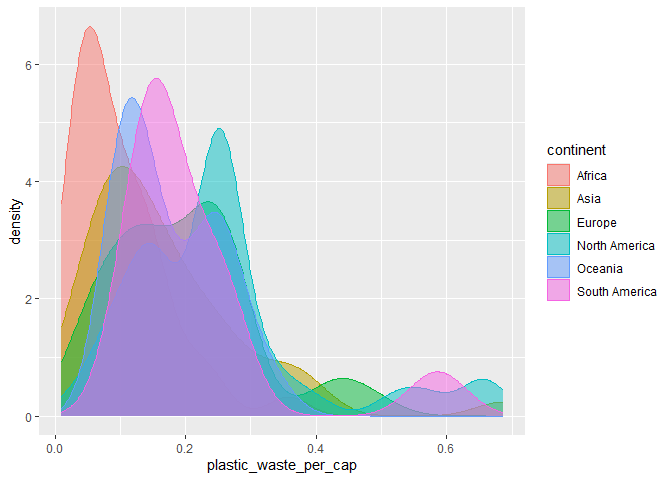
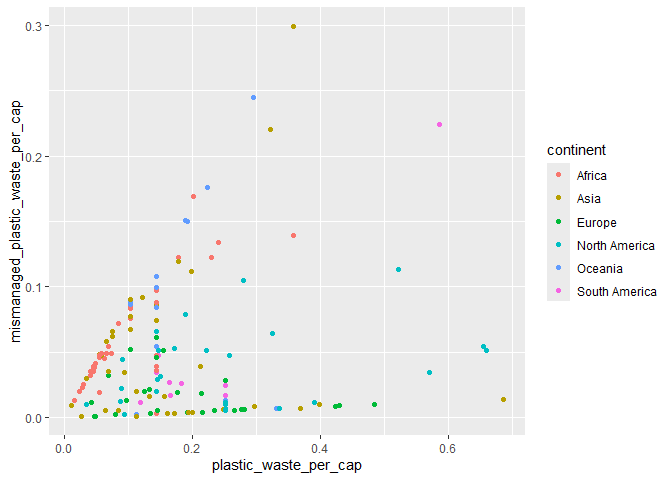
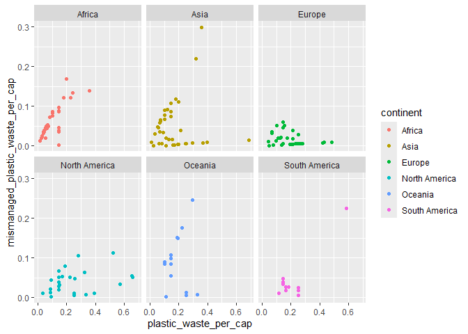
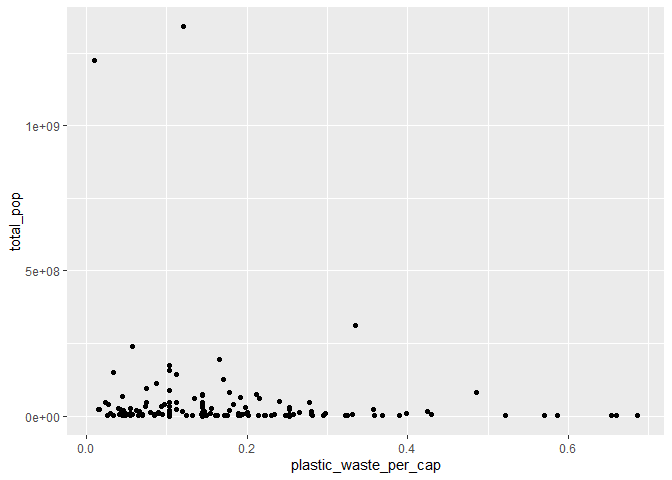
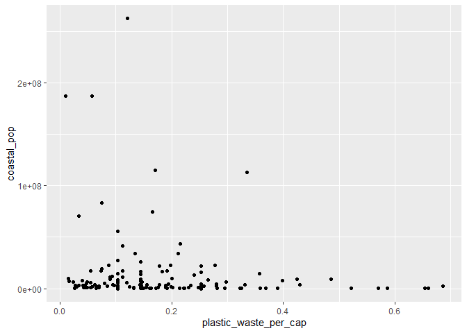
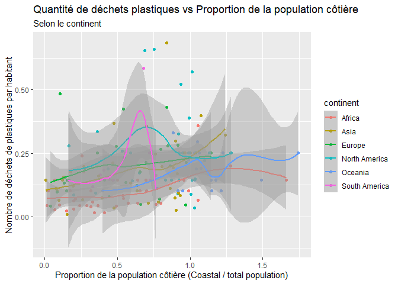

Lab 02 - Plastic waste
================
Jade Gélinas
15 septembre 2025

## Chargement des packages et des données

``` r
library(tidyverse) 
```

``` r
plastic_waste <- read_csv("data/plastic-waste.csv")
```

Commençons par filtrer les données pour retirer le point représenté par
Trinité et Tobago (TTO) qui est un outlier.

``` r
plastic_waste <- plastic_waste %>%
  filter(plastic_waste_per_cap < 3.5)
```

plastic_waste \<- read_csv(“data/plastic-waste.csv”)

## Exercices

### Exercise 1

``` r
 ggplot(plastic_waste, aes(x = plastic_waste_per_cap)) +
  geom_histogram(binwidth = 0.2)+
  facet_wrap(~continent)
```

<!-- -->

### Exercise 2

``` r
ggplot(plastic_waste, aes(x = plastic_waste_per_cap)) +
  geom_density(adjust=1)
```

<!-- -->

``` r
ggplot(plastic_waste, aes(x = plastic_waste_per_cap,color=continent)) +
  geom_density(adjust=1)
```

<!-- -->

``` r
ggplot(plastic_waste, aes(x = plastic_waste_per_cap,fill=continent, color=continent)) +
  geom_density(adjust=1)
```

<!-- -->

``` r
ggplot(plastic_waste, aes(x = plastic_waste_per_cap,fill=continent, color=continent)) +
  geom_density(adjust=1,alpha=0.5)
```

<!-- -->

Réponse à la question… Parce que les directives (color et fill) sont des
caractéristiques principales et peuvent donc être envoyés directement
sur les variables. Ces deux directives jouent aussi sur l’esthétique du
graphique contrairent au alpha qui sert à rendre la lecture du grapique
plus facile lorsque que plusieurs données se chevauchent. \### Exercise
3

Boxplot:

``` r
ggplot(plastic_waste, aes(x =continent,y=plastic_waste_per_cap)) +
  geom_boxplot()
```

<!-- -->

Violin plot:

``` r
ggplot(plastic_waste, aes(x =continent, y = plastic_waste_per_cap)) +
  geom_violin()
```

<!-- -->

Réponse à la question… On voit mieux la répartition de la pollution par
habitants grâce aux violons contrairement au box plot qui se concentre
sur la moyenne des et non la dispersion de la pollution par habitants.
\### Exercise 4

``` r
ggplot(data = plastic_waste,
       mapping = aes(x = plastic_waste_per_cap,
                     y = mismanaged_plastic_waste_per_cap,
                     color=continent
                     )) +
  geom_point()
```

<!-- -->

``` r
ggplot(data = plastic_waste,
       mapping = aes(x = plastic_waste_per_cap,
                     y = mismanaged_plastic_waste_per_cap,
                     color=continent
                     )) +
  geom_point()+
  facet_wrap(~continent)
```

<!-- -->

Réponse à la question…

### Exercise 5

``` r
ggplot(data = plastic_waste,
       mapping = aes(x = plastic_waste_per_cap,
                     y = total_pop,
                     )) + 
  geom_point()
```

    ## Warning: Removed 10 rows containing missing values or values outside the scale range
    ## (`geom_point()`).

<!-- -->

``` r
ggplot(data = plastic_waste,
       mapping = aes(x = plastic_waste_per_cap,
                     y = coastal_pop
                     )) +
  geom_point()
```

<!-- -->

Réponse à la question…

## Conclusion

Recréez la visualisation:

``` r
plastic_waste_coastal <- plastic_waste %>% 
mutate(coastal_pop_prop = coastal_pop / total_pop) %>%
filter(plastic_waste_per_cap <3)
ggplot(plastic_waste_coastal,
       mapping = aes(x = coastal_pop_prop,
                     y = plastic_waste_per_cap,
                     colour = continent)) +
  geom_point() +
  labs(title = "Quantité de déchets plastiques vs Proportion de la population côtière",
       subtitle = "Selon le continent",
       x = "Proportion de la population côtière (Coastal / total population)",y= "Nombre de déchets de plastiques par habitant", color= "continent")+
geom_smooth()
```

    ## `geom_smooth()` using method = 'loess' and formula = 'y ~ x'

    ## Warning: Removed 10 rows containing non-finite outside the scale range
    ## (`stat_smooth()`).

    ## Warning: Removed 10 rows containing missing values or values outside the scale range
    ## (`geom_point()`).

<!-- -->
